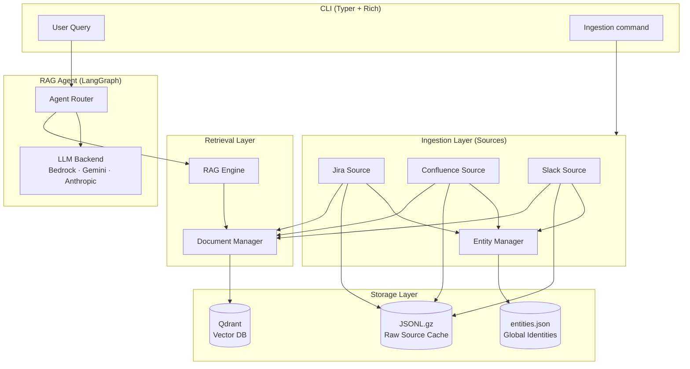

# Vatuta - Virtual Assistant for Task Understanding, Tracking & Automation

<div align="center">
  

  <p><em>Virtual Assistant for Task Understanding, Tracking &amp; Automation</em></p>

  [](https://github.com/franjuan/vatuta/actions/workflows/ci.yml)
  [](https://www.python.org/)
  [](LICENSE)
  [](https://github.com/astral-sh/ruff)
  [](https://mypy-lang.org/)
  [](https://python-poetry.org/)
  [](https://github.com/pre-commit/pre-commit)
  [](https://python.langchain.com/)
  [](https://qdrant.tech/)
  [](https://github.com/stanfordnlp/dspy)
</div>

---

Vatuta is a **portfolio PoC** that demonstrates how RAG and LLMs can act as a **single source of truth
for engineering managers**. A manager's constant burden is knowing the status of every task, issue, and
decision — instantly, accurately, and in full detail. Vatuta ingests knowledge from Jira, Confluence,
Slack, and other sources into a unified vector knowledge base, making that information queryable in plain
language from a single CLI.

> **Why Vatuta?** Being a manager means being responsible for knowing the state of everything, at all
> times, with full context. Vatuta is a proof of concept showing how a RAG system can reduce that mental
> load — replacing frantic tab-switching with a single, honest, up-to-date answer.

---

## Table of Contents

- [Features](#features)
- [Architecture](#architecture)
- [Tech Stack](#tech-stack)
- [Quick Start](#quick-start)
- [Installation](#installation)
- [Configuration](#configuration)
- [Integrations](#integrations)
- [Project Structure](#project-structure)
- [Development](#development)
- [Contributing](#contributing)
- [License](#license)

---

## Features

### Data ingestion & knowledge base

- 🎫 **Jira** — tickets, comments, history, and changelogs with semantic chunking strategies
- 📄 **Confluence** — spaces and pages with full HTML-to-Markdown conversion
- 💬 **Slack** — channels, threads, DMs and group DMs with rate-limit-aware ingestion
- 🦊 **GitLab** — issues and MRs *(PoC)*
- 📅 **Google Calendar** — events and schedules *(work in progress)*
- ⚡ Incremental updates with checkpointing and caching (no full re-ingestion)
- 📏 Dynamic chunk size limits automatically capped by the embedding model's capacity to prevent truncation
- 👤 **Global Entity Manager** — resolves the same entity (users right now) across Jira,
  Confluence and Slack *(work in progress)*

### Query & retrieval

- 🔍 Vector-based semantic search over all your sources simultaneously
- 🗂️ Metadata filtering and selection of sources
- 🔀 Dynamic routing for applying filtering or collecting documents as interpreted from query
- 🧠 LangGraph-powered RAG agent with tool-based retrieval
- 🌐 Multiple LLM backends: **AWS Bedrock**, **Google Gemini**, **Anthropic Claude**
- 📊 Configurable `k` parameter and source-display for transparent answers

### Observability

- 📈 Prometheus metrics for every source and retrieval operation

### Developer experience

- 🏗️ Typed codebase with strict mypy, Ruff, and Black enforcement
- 🔒 Security checks: Bandit, Semgrep, pip-audit, detect-secrets
- 🪝 Pre-commit hooks and GitHub Actions CI pipeline

---

## Architecture



Three main layers:

| Layer | Components | Purpose |
| ----- | ---------- | ------- |
| **Ingestion** | Sources + Entity Manager + Document Manager | Fetch, parse, resolve identities, chunk, and store sources of data |
| **Storage** | Qdrant (vectors) + JSONL cache + entities.json | Persistent vector index and raw data for queries |
| **Query** | RAG Engine + LangGraph Agent + LLM | Semantic search and natural language answers |

---

## Tech Stack

| Category | Technology | Role |
| -------- | ---------- | ---- |
| AI Framework | [LangChain](https://github.com/langchain-ai/langchain), [LangGraph](https://github.com/langchain-ai/langgraph) | Agent orchestration and RAG chains |
| Prompt Engineering | [DSPy](https://github.com/stanfordnlp/dspy) | Prompt formalization and optimization |
| LLM Providers | AWS Bedrock, Google Gemini, Anthropic Claude | Language model backends |
| Vector Database | [Qdrant](https://qdrant.tech/qdrant-vector-database/) | Semantic document storage and search |
| Embeddings | [Sentence Transformers](https://sbert.net/) | Local embedding generation (no API cost) |
| NLP | [spaCy](https://spacy.io/) | Intelligent text chunking |
| Data Sources | Jira, Confluence, Slack, GitLab, Google APIs | Knowledge ingestion |
| CLI | [Typer](https://typer.tiangolo.com/) + [Rich](https://github.com/Textualize/rich) | Interactive command-line interface |
| Observability | [Prometheus](https://prometheus.io/) | Metrics for ingestion and retrieval |
| Dependency Mgmt | [Poetry](https://python-poetry.org/) | Package and virtualenv management |
| Task Automation | [Just](https://github.com/casey/just) | Developer task runner |
| Linting | [Ruff](https://github.com/astral-sh/ruff), [mypy](https://mypy-lang.org/) | Code quality and type checking |
| Security | [Bandit](https://github.com/PyCQA/bandit), [Semgrep](https://github.com/semgrep/semgrep), [pip-audit](https://github.com/pypa/pip-audit), [detect-secrets](https://github.com/Yelp/detect-secrets) | Static analysis and vulnerability scanning |
| CI/CD | [GitHub Actions](https://github.com/features/actions) | Automated testing, linting, and SBOM generation |

---

## Quick Start

> These steps get Vatuta **running as a user** — querying your tools from the CLI.
> If you want to contribute or develop, see [Installation](#installation) instead.

### Prerequisites

| Tool | Version | Notes |
| ---- | ------- | ----- |
| [Python](https://www.python.org/) | >= 3.12 | Tested up to 3.14 |
| [Poetry](https://python-poetry.org/) | >= 1.8 | Dependency and virtualenv management |
| [Just](https://github.com/casey/just) | any | Task runner |
| [Docker](https://www.docker.com/) | any | Optional — only needed to run Qdrant locally (see [qdrant_setup.md](docs/qdrant_setup.md)) |

You will also need credentials for:

- **Data sources** — API keys for the tools you want to ingest (Jira, Confluence, Slack, etc.)
- **LLM backend** — at least one of: AWS Bedrock credentials, Google Gemini API key, or Anthropic API key

See [Configuration](#configuration) for the full list of required variables.

### Steps

```bash
# 1. Clone the repository
git clone git@github.com:franjuan/vatuta.git
cd vatuta

# 2. Configure your credentials
#    Copy the template and fill in your API keys (Jira, Confluence, Slack, LLM backend, etc.)
cp env.example .env
# Edit .env — just loads it automatically, no manual source needed

# 3. Install runtime dependencies
#    Creates the virtualenv, installs packages, and downloads the spaCy NLP model
just install

# 4. Start the vector database
#    Skip this step if you already have a Qdrant instance running elsewhere
just qdrant-start

# 5. Configure your data sources
#    Tell Vatuta which Jira projects, Confluence spaces, and Slack channels to ingest
cp config/vatuta.yaml.example config/vatuta.yaml
# Edit config/vatuta.yaml to enable and configure your sources

# 6. Ingest data from your sources
#    Fetches documents, chunks them, embeds them, and stores vectors in Qdrant
just load-sources

# 7. Ask a question
#    Runs the assistant with --show-sources and --show-stats flags (defined in justfile)
just assistant "What tickets are blocking the release?" 20
```

---

## Installation

> These steps set up a **full development environment** for contributing to or extending Vatuta.
> If you just want to run the app, follow the [Quick Start](#quick-start) instead.

### Additional prerequisites

On top of the [Quick Start prerequisites](#prerequisites):

| Tool | Version | Notes |
| ---- | ------- | ----- |
| [direnv](https://direnv.net/) | any | Optional — auto-activates the Poetry virtualenv on `cd` |
| [pre-commit](https://pre-commit.com/) | any | Optional — required to contribute |

### Development setup

```bash
# Clone the repository
git clone git@github.com:franjuan/vatuta.git
cd vatuta

# (Optional) Auto-activate the Poetry virtualenv when entering the directory
# Note: .env is already loaded by just — direnv only adds virtualenv auto-activation
direnv allow

# Install all dependencies including dev tools (linters, type checkers, test suite)
just setup

# (Optional) Install pre-commit hooks
#    Runs linters, type checks, and security scans automatically before each commit
just pre-commit-install
```

---

## Configuration

Vatuta uses **two configuration files** that work together:

### 1. `.env` — Credentials and secrets

Copy `env.example` to `.env` and fill in your credentials:

```bash
cp env.example .env
```

| Variable | Required | Description |
| -------- | -------- | ----------- |
| **LLM backends** | | |
| `GEMINI_API_KEY` | For Gemini | Google AI API key |
| `AWS_REGION` | For Bedrock | AWS region (e.g. `us-east-1`) |
| `AWS_PROFILE` | For Bedrock | AWS named profile — used when no bearer token is set |
| `AWS_BEARER_TOKEN_BEDROCK` | For Bedrock | Bearer token — alternative to profile auth |
| **Data sources** | | |
| `JIRA_USER` | For Jira/Confluence | Atlassian account email |
| `JIRA_API_TOKEN` | For Jira/Confluence | Atlassian API token |
| `SLACK_BOT_TOKEN` | For Slack | Bot token (`xoxb-...`) |
| **Infrastructure** | | |
| `QDRANT_API_KEY` | Recommended | Leave empty for unauthenticated local dev |
| **Application** | | |
| `LOG_LEVEL` | No | Log verbosity. Default: `INFO` |

> **Note:** Source URLs, project keys, spaces, and channel lists live in `config/vatuta.yaml`, not in `.env`.
> See the next section for details.

### 2. `config/vatuta.yaml` — Application configuration

Copy the example and edit:

```bash
cp config/vatuta.yaml.example config/vatuta.yaml
```

```yaml
# LLM backend selection
rag:
  llm_backends:
    bedrock:
      model_id: "bedrock/us.anthropic.claude-3-7-sonnet-20250219-v1:0"
      temperature: 0.2
    gemini:
      model_id: "gemini/gemini-3-flash-preview"
      temperature: 1.0

  router_backend: "gemini"
  generator_backend: "bedrock"

# Cross-source identity resolution storage
entities_manager:
  storage_path: "data/entities.json"

# Qdrant vector database
qdrant:
  url: "http://localhost:6333"
  collection_name: "vatuta_documents"
  embeddings_model: "intfloat/multilingual-e5-small"

# Sources to ingest
sources:
  slack:
    slack-main:
      enabled: true
      workspace_domain: "https://your-workspace.slack.com"
      channel_types:
        - "public_channel"
        - "private_channel"
        - "im"
        - "mpim"
      initial_lookback_days: 30
      channel_window_minutes: 60
      user_cache_path: "data/slack/slack-main/slack_users_cache.json"
      user_cache_ttl_seconds: 7 * 24 * 60 * 60
      chunk_embedding_model: "intfloat/multilingual-e5-small"

  jira:
    jira-main:
      enabled: true
      url: "https://your-domain.atlassian.net"
      projects: ["PROJECT1", "PROJECT2"]
      chunk_embedding_model: "intfloat/multilingual-e5-small"

  confluence:
    confluence-main:
      enabled: true
      url: "https://your-domain.atlassian.net"
      spaces: ["SPACE1"]
      initial_lookback_days: 30
```

For detailed per-source configuration, see [docs/integrations.md](docs/integrations.md).

---

## Integrations

Vatuta ingests data from multiple sources into a shared Qdrant vector collection. All sources support:

- ✅ Vector-based semantic search
- ✅ Incremental updates with checkpointing (no full re-ingestion)
- ✅ Cross-source identity resolution via the [Entity Manager](docs/entity_manager.md)
- ✅ Configurable date ranges and filters
- ✅ Prometheus metrics

| Integration | Status | Doc |
| ----------- | ------ | --- |
| Jira | ✅ Stable | [docs/sources/jira.md](docs/sources/jira.md) |
| Confluence | ✅ Stable | [docs/sources/confluence.md](docs/sources/confluence.md) |
| Slack | ✅ Stable | [docs/sources/slack.md](docs/sources/slack.md) |
| GitLab | 🧪 PoC | — |
| Google Calendar | 🚧 In Progress | — |

For full setup and usage instructions, see [docs/integrations.md](docs/integrations.md).

### Qdrant Vector Database

Vatuta requires a running Qdrant instance.

You can use your own instance or the one managed via Docker through `just` commands:

```bash
just qdrant-start      # Start the container
just qdrant-status     # Check status
just qdrant-dashboard  # Open the web UI at http://localhost:6333/dashboard
just qdrant-stop       # Stop the container
```

See [docs/qdrant_setup.md](docs/qdrant_setup.md) for full setup and troubleshooting.

---

## Project Structure

```text
vatuta/
├── src/
│   ├── client/        # CLI entry point (Typer app)
│   ├── entities/      # Global Entity Manager (cross-source identity resolution)
│   ├── metrics/       # Prometheus metrics collectors
│   ├── models/        # Pydantic data models (Document, Chunk, Config)
│   ├── rag/           # RAG engine, LangGraph agent, Qdrant manager, tools
│   ├── sources/       # Data source connectors (Jira, Confluence, Slack, GitLab)
│   └── utils/         # Shared utilities
├── tests/             # Unit tests (pytest)
├── docs/              # Documentation
│   └── sources/       # Per-source design decisions and configuration reference
├── config/            # vatuta.yaml and vatuta.yaml.example
├── pocs/              # Proof-of-concept and experimental scripts
├── data/              # Local data storage (Qdrant, JSONL cache, entities)
├── logs/              # Application logs
├── .github/workflows/ # GitHub Actions CI pipeline
├── justfile           # Task automation commands
├── pyproject.toml     # Poetry configuration, tool settings
├── poetry.lock        # Locked dependencies versions
├── .pre-commit-config.yaml # Pre-commit hooks configuration
├── .secrets.baseline  # Baseline for detect-secrets
├── .pip-audit-ignore  # Ignored vulnerabilities for pip-audit
├── .markdownlint.json # Markdown style rules
├── .envrc             # direnv environment loading script
├── pyrefly.toml       # LSP settings
├── AGENTS.md          # AI Assistant coding instructions
├── CONTRIBUTING.md    # Contribution guidelines
├── LICENSE            # Open source license
├── THIRD_PARTY.md     # Third-party licenses
└── env.example        # Environment variables template
```

---

## Development

### Common commands

```bash
# Setup & Environment
just setup                            # Complete dev setup (deps + spaCy)
just clean                            # Clean up temporary/cache files
just reset                            # Full reset (removes venv + temp files)

# Running & Ingestion
just vatuta-help                      # Show vatuta help
just assistant query="..." k="20"     # Query with explicit parameters
just load-sources                     # Ingest data from all enabled sources
just qdrant-start                     # Start Qdrant local vector db instance

# Testing & Code Quality
just check                            # Run all checks (lint + format-check + test)
just test                             # Run the test suite
just test-coverage                    # Run tests with HTML coverage report
just format                           # Auto-format code (Black + Ruff + isort)
just lint                             # Run linters (Ruff, mypy, detect-secrets)
just pre-commit                       # Run all pre-commit hooks manually
just cc                               # Generate cyclomatic complexity report

# Tooling & Info
just dep-path [dep]                   # Analyze dependency chains
just --list                           # See all available project commands
```

### Environment management (direnv)

With [direnv](https://direnv.net/) enabled, the `.env` file and Poetry virtualenv are activated
automatically when you `cd` into the project — no manual `poetry shell` or `source .env` needed.

```bash
direnv allow   # Enable once after cloning
```

### Code quality pipeline

The project enforces quality through pre-commit hooks and GitHub Actions:

| Tool | Purpose |
| ---- | ------- |
| **Black** | Code formatting |
| **Ruff** | Fast linting (E, W, F, I, C, B rules) |
| **isort** | Import ordering |
| **mypy** | Static type checking (strict mode) |
| **pydocstyle** | Docstring validation (Google convention) |
| **Bandit** | Security static analysis (SAST) |
| **Semgrep** | Advanced SAST rules |
| **pip-audit** | Dependency CVE scanning |
| **Radon / Xenon** | Cyclomatic complexity enforcement |
| **jscpd** | Code duplication detection |
| **detect-secrets** | Secret leak prevention |
| **CodeQL** | GitHub Advanced Security scanning |

### Running tests

```bash
just test                # All tests
just test -v             # Verbose
just test-coverage       # With HTML coverage report (htmlcov/)
```

---

## Future Improvements

The current project is a proof of concept. The following areas represent key opportunities for future enhancement:

- **Real-Time Ingestion**: Transitioning from scheduled batch processing to event-driven streaming would enable
  proactive, real-time responses to new data.

- **Source Citations**: Enforcing direct linking to original sources in the LLM prompt would improve response
  auditability and reduce hallucinations.

- **Reranking Over Filtering**: Instead of dropping chunks with missing metadata prior to search, implement a
  reranking step to preserve potentially relevant documents in the context.

- **Hybrid Retrieval**: Combine dense semantic vectors with sparse lexical representations in Qdrant to improve
  searches for exact terms, acronyms, and ticket IDs.

- **GraphRAG Implementation**: Explore GraphRAG to better handle broad queries, relationships between entities,
  and aggregations that currently overwhelm the standard vector RAG approach.

- **Unsupervised Topic Classification**: Automatically categorize queries and document chunks by topic to enhance
  filtering and reranking accuracy.

- **Testing & Validation**: Expand unit test coverage and implement robust validation mechanisms across the
  codebase.

- **Automated Prompt Optimization**: Leverage DSPy to automatically optimize prompts using defined metrics and
  evaluation samples.

- **Proactive Agents**: Evolve the assistant from a reactive query-responder to a proactive agent capable of
  responding to system triggers or scheduled events.

- **Comprehensive Security Analysis**: Supplement existing static and dependency scans with a thorough evaluation
  against the OWASP Top 10 for LLMs and Generative AI.

- **Extended LLM Support**: Validate and integrate additional language models once a robust evaluation framework
  is established.

- **Slack Channel Filtering**: Expose the existing internal support for filtering Slack ingestion by specific
  `channel_ids` through the application configuration and CLI.

- **Entity Manager Overhaul**: Completely review and refactor the cross-source identity resolution architecture.

---

## Contributing

Contributions are welcome! Please read [CONTRIBUTING.md](CONTRIBUTING.md) before opening a pull request.

---

## License

- **Code** is licensed under the **Apache License 2.0**. See [LICENSE](LICENSE).
- **Documentation & content** (docs, diagrams, and original images) are licensed under **CC BY 4.0**. See [LICENSE-docs](LICENSE-docs).
- **Third-party materials** (dependencies, icons, fonts) may have their own licenses. See [THIRD_PARTY.md](THIRD_PARTY.md).
