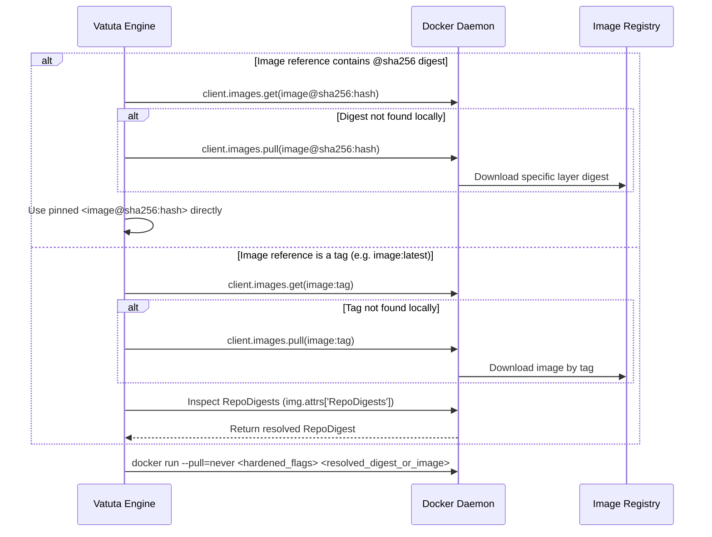

# MCP Server Security & Integration Model in Vatuta

This document defines the architecture, security policy, and hardening guidelines for executing MCP
(Model Context Protocol) servers via Docker containers within Vatuta.

---

## 1. Overview & Purpose

- **Agent Tool Integration**: Vatuta integrates MCP servers as tools for ReAct agents across its various features.
- **Docker Stdio Transport**: Integration is currently based on `stdin`/`stdout` communication with Docker images
  loaded and managed directly by Vatuta.

---

## 2. Security Philosophy

Any Docker image used as an MCP server (communicating via `stdio`) is treated as **untrusted code** with access
limited strictly to the `stdin` and `stdout` channels.

Consequently, Vatuta enforces a **Least Privilege Principal** default `docker run` profile to ensure an MCP
server cannot compromise the host system, escalate privileges, or access unauthorized resources.

---

## 3. Image Resolution, Inspection & Pre-Run Pull Workflow

Because `docker run` is strictly executed with `--pull=never` to prevent implicit downloads or unexpected runtime
image changes, Vatuta separates image management into an explicit pre-run workflow:



### Image Resolution Protocol

1. **Python Docker SDK Management (`docker.from_env()`)**: Pre-run image checks, pulls, and RepoDigest inspections
   are handled cleanly and synchronously using the official Python Docker SDK prior to starting the async MCP stdio
   session.
2. **Digest-Pinned Image Reference (`image@sha256:<hash>`)**:
   - If the configuration specifies an explicit digest (containing `@sha256:` or `@`), Vatuta uses the hash
     directly.
   - It checks local availability via `client.images.get(image)`. If missing and `auto_pull` is enabled, it performs
     `client.images.pull(image)`.
   - The container is executed using the exact pinned hash reference.
3. **Tag-Referenced Image (`image:tag` or `image`)**:
   - If the configuration specifies a tag, Vatuta inspects/pulls the tag reference via `client.images.get()` /
     `client.images.pull()`.
   - It resolves the immutable repository digest using `img.attrs.get('RepoDigests')`.
   - The container execution is pinned to the resolved RepoDigest.

---

## 4. Security Parameter Specification

### 4.1. Input / Output (`-i`, NEVER `-t`)

- **`-i` (Interactive)**: Required. Keeps `stdin` open for JSON-RPC message exchange.
- **No `-t` (No TTY)**: **NEVER** use `-t`. A pseudo-TTY introduces terminal control codes and escape sequences
  that corrupt the JSON-RPC stream on `stdout`. `stdout` must contain valid JSON-RPC messages exclusively.
  `stderr` is reserved for server logging.

### 4.2. Ephemeral Containers (`--rm`)

- Always include `--rm` to automatically remove the container and any anonymous volumes upon exit, preventing
  container sprawl and persistent state leakage.

### 4.3. Network Isolation (`--network=none`)

- **Default**: `--network=none`. The container has no network interfaces.
- **Forbidden**: `--network=host`, `-p`, `-P` (port publication).
- **Network Egress Servers (e.g., `mcp/fetch`)**: Must be declared as a distinct class (`network: "egress_required"`)
  and executed within isolated networks or egress-filtered gateways.

### 4.4. Read-Only Root Filesystem (`--read-only`)

- The container root filesystem is mounted as read-only (`--read-only`).
- A small, constrained in-memory temporary filesystem is provided for runtime scratch needs:

  ```bash
  --tmpfs /tmp:rw,noexec,nosuid,nodev,size=64m
  ```

### 4.5. Bind Mounts & Volumes

- **Default**: No volumes mounted (`mounts: []`).
- **Allowed Bind Mounts**: Must be mounted as read-only (`ro`):

  ```bash
  --mount type=bind,src=/tmp/vatuta-mcp-test,dst=/workspace,readonly
  ```

- **Strictly Prohibited Mounts**:
  - Docker Socket: `/var/run/docker.sock` (grants full host root access).
  - Host Root and System Directories: `/`, `/home`, `/etc`, `/root`, `/sys`, `/proc`, `/dev`, `/boot`, `/var`
    (and system paths like `/var/run/`, `/var/lib/docker`, `/var/log`).
  - *Note*: Specific application data subdirectories (e.g., `/var/lib/vatuta/...`) are permitted.
  - *Customization*: The `forbidden_exact_paths` and `forbidden_path_prefixes` lists can be customized in the
    `MCPContainerConfig` YAML node to harden or adjust the default policy per-server instance.

### 4.6. Non-Root User (`--user 1000:1000`)

- Execution under an unprivileged user ID and group ID (`--user 1000:1000`).

### 4.7. Kernel Capabilities (`--cap-drop=ALL`)

- Drop all Linux kernel capabilities (`--cap-drop=ALL`). Adding capabilities (`--cap-add`) is forbidden unless
  explicitly justified.

### 4.8. Prevention of Privilege Escalation

- `--security-opt no-new-privileges=true`: Prevents child processes from gaining additional privileges via `setuid`
  or `setgid` binaries.

### 4.9. System Call Confinement (`seccomp` & AppArmor)

- `--security-opt seccomp=builtin`: Enforces the default Docker system call allowlist. `seccomp=unconfined` is
  prohibited.
- `--security-opt apparmor=docker-default`: Enforces standard AppArmor profiling. `apparmor=unconfined` is
  prohibited.

### 4.10. Resource Limits

To protect against Denial of Service (DoS) and resource exhaustion:

- RAM: `--memory=128m` or `--memory=256m` (`--memory-swap` set to equal value).
- CPU: `--cpus=0.25` or `--cpus=0.5`.
- Concurrent PIDs: `--pids-limit=64` or `--pids-limit=128`.
- File Descriptors: `--ulimit nofile=128:128` (or `256:256`).

---

## 5. Hardened Execution Profiles

### Profile A: Ultra-Restricted (Default)

For pure compute/transform servers with no network or volume requirements (e.g., `mcp/everything`, `mcp/time`):

```bash
docker run \
  -i \
  --rm \
  --pull=never \
  --network=none \
  --read-only \
  --tmpfs /tmp:rw,noexec,nosuid,nodev,size=64m \
  --user 1000:1000 \
  --cap-drop=ALL \
  --security-opt no-new-privileges=true \
  --security-opt seccomp=builtin \
  --pids-limit=64 \
  --memory=128m \
  --memory-swap=128m \
  --cpus=0.25 \
  --ulimit nofile=128:128 \
  mcp/everything
```

### Profile B: Filesystem Read-Only

For MCP servers inspecting isolated local host directories:

```bash
docker run \
  -i \
  --rm \
  --pull=never \
  --network=none \
  --read-only \
  --tmpfs /tmp:rw,noexec,nosuid,nodev,size=64m \
  --user 1000:1000 \
  --cap-drop=ALL \
  --security-opt no-new-privileges=true \
  --security-opt seccomp=builtin \
  --pids-limit=128 \
  --memory=256m \
  --memory-swap=256m \
  --cpus=0.5 \
  --ulimit nofile=256:256 \
  --mount type=bind,src=/tmp/vatuta-mcp-test,dst=/workspace,readonly \
  mcp/filesystem \
  /workspace
```

### Profile C: Egress Required

For MCP servers fetching remote external APIs (e.g., `mcp/fetch`):

```bash
docker run \
  -i \
  --rm \
  --pull=never \
  --read-only \
  --tmpfs /tmp:rw,noexec,nosuid,nodev,size=64m \
  --user 1000:1000 \
  --cap-drop=ALL \
  --security-opt no-new-privileges=true \
  --security-opt seccomp=builtin \
  --pids-limit=128 \
  --memory=256m \
  --memory-swap=256m \
  --cpus=0.5 \
  --ulimit nofile=256:256 \
  mcp/fetch
```

---

## 6. Prohibited Configurations & Security Policy

These non-recommended parameters are prohibited by Vatuta. Protection is enforced **by design** (the typed
configuration builder does not expose or accept arbitrary flags), while active path validation explicitly rejects
forbidden volume mount paths (system directories, subpaths, and the Docker socket).

Prohibited parameters include:

- `--privileged`
- `--cap-add`
- `--security-opt seccomp=unconfined`
- `--security-opt apparmor=unconfined`
- `--security-opt label=disable`
- `--pid=host`, `--ipc=host`, `--network=host`, `--uts=host`
- `--userns=host`
- `--device`
- Docker Socket bind mounts (`/var/run/docker.sock`)
- Root/System bind mounts (`/`, `/home`, `/etc`, `/var`, `/root`)
- Port publications (`-p`, `-P`)
- Unfiltered environment files (`--env-file`)

---

## 7. Configuration Schema

MCP servers are configured in `config/vatuta.yaml` under the top-level `mcp_servers` key. Each server entry is
parsed into the `MCPContainerConfig` Pydantic model (`src/mcp/config.py`), which defines security policies,
resource constraints, container arguments, volume mounts, and tool whitelists.

### 7.1. YAML Configuration Example

```yaml
mcp_servers:
  everything:
    image: "mcp/everything@sha256:4f85...a612"
    auto_pull: true
    allow_network: false
    read_only: true
    tmpfs_options: "rw,noexec,nosuid,nodev,size=64m"
    user: "1000:1000"
    cap_drop:
      - "ALL"
    pids_limit: 64
    memory: "128m"
    memory_swap: "128m"
    cpus: "0.25"
    nofile: "128:128"
    mounts: []
    allowed_tools:
      - "^echo$"
      - "^add$"

  wikipedia:
    image: "mcp/wikipedia-mcp"
    auto_pull: true
    allow_network: true
    read_only: true
    # Command-line arguments passed directly to the container entrypoint/binary
    args:
      - "--language"
      - "es"
    allowed_tools:
      - "^search_wikipedia$"
      - "^get_summary$"

  custom_filesystem:
    image: "mcp/filesystem"
    auto_pull: true
    allow_network: false
    read_only: true
    # Volume mounts: list of [host_path, container_path, mode] 3-tuples (must be 'ro')
    mounts:
      - ["/tmp/vatuta-mcp-data", "/workspace", "ro"]
    args:
      - "/workspace"
```

### 7.2. Passing Arguments to Container Entrypoints (`args`)

Many MCP server Docker images require runtime command-line flags or arguments passed directly to their executable
binary (e.g. specifying language codes, root search paths, or API server targets).

Use the `args` field (a YAML list of strings) to pass arguments to the container entrypoint:

```yaml
wikipedia:
  image: "mcp/wikipedia-mcp"
  args:
    - "--language"
    - "es"
```

When Vatuta builds the container execution command, `args` are appended immediately after the image reference:
`docker run <hardened_flags> mcp/wikipedia-mcp --language es`.

### 7.3. Volume Bind Mounts (`mounts`)

To allow an MCP server container to inspect host files, use the `mounts` field. Each mount is specified as a 3-element
list: `[host_path, container_path, mode]`.

- **Strict Mode Policy**: `mode` MUST strictly be `"ro"` (read-only). Read-write mounts (`"rw"`) are rejected by schema
  validation.
- **Path Security Rules**: `host_path` is validated against `forbidden_exact_paths` and `forbidden_path_prefixes` to
  prevent mounting host system directories (e.g., `/`, `/etc`, `/root`, `/var/run/docker.sock`).

Example YAML syntax:

```yaml
mounts:
  - ["/home/user/docs", "/workspace", "ro"]
```

### 7.4. Complete Field Reference Table (`MCPContainerConfig`)

| Field | Type | Default | Description |
| ----- | ---- | ------- | ----------- |
| `name` | `str` | Dict key | Unique identifier for the server instance (injected from YAML dict key). |
| `image` | `str` | *Required* | Docker image reference (tag or pinned `@sha256:hash`). |
| `auto_pull` | `bool` | `true` | Automatically inspect and pull missing images or digests. |
| `allow_network` | `bool` | `false` | Enable network access (`--network=none` when `false`). |
| `read_only` | `bool` | `true` | Mount root filesystem as read-only (`--read-only`). |
| `args` | `list[str]` | `[]` | Command-line arguments passed directly to container executable. |
| `mounts` | `list[tuple]` | `[]` | List of `[host_path, container_path, "ro"]` volume bind mounts. |
| `allowed_tools` | `list[str]` | `null` | Regex patterns to whitelist allowed tools exposed to the agent. |
| `allowed_prompts` | `list[str]` | `null` | Regex patterns to whitelist allowed prompts exposed to the agent. |
| `allowed_resources` | `list[str]` | `null` | Regex patterns to whitelist allowed resources exposed to the agent. |
| `tmpfs_options` | `str` | `"rw,noexec,nosuid,nodev,size=64m"` | Options for in-memory `/tmp` filesystem. |
| `user` | `str` | `"1000:1000"` | `UID:GID` for unprivileged container process execution. |
| `cap_drop` | `list[str]` | `["ALL"]` | Linux kernel capabilities dropped. |
| `pids_limit` | `int` | `64` | Maximum concurrent PIDs allowed inside container. |
| `memory` | `str` | `"128m"` | Memory limit (e.g. `"128m"`, `"256m"`). |
| `memory_swap` | `str` | `"128m"` | Swap memory limit (should equal `memory`). |
| `cpus` | `str` | `"0.25"` | CPU quota limit (e.g. `"0.25"`, `"0.5"`). |
| `nofile` | `str` | `"128:128"` | File descriptor ulimit configuration. |
| `forbidden_exact_paths` | `set[str]` | Default set | Exact host paths forbidden from volume mounting. |
| `forbidden_path_prefixes` | `tuple[str]` | Default tuple | Host path prefixes forbidden from volume mounting. |

---

## 8. LangGraph RAG Agent Integration

Vatuta integrates MCP servers directly into its LangGraph-based `RAGAgent`.
The integration automatically starts the configured MCP servers, discovers their available tools,
and exposes them dynamically to the LLM (using a ReAct router node powered by DSPy).

### Lifecycle and Execution Model

1. **Configuration Loading**: MCP servers defined under `mcp_servers` in `vatuta.yaml` are loaded upon application startup.
2. **Async/Sync Bridging**: Since `RAGAgent` and DSPy operate synchronously while `MCPServer` relies
   on `asyncio` to manage Docker processes, a dedicated background thread (`AsyncLoopThread`) is used
   to maintain the asyncio event loop for the MCP servers.
3. **Dynamic Tool Generation**: During agent initialization, the agent fetches the tools exposed by the MCP server
   (`list_tools`). Each tool is dynamically wrapped into an `MCPToolWrapper` (inheriting from `AgentTool`),
   converting its JSON schema into a Pydantic model (`args_schema`) and making it available for the ReAct router.
4. **Execution**: When the LLM decides to use an MCP tool, the `MCPToolWrapper` bridges the synchronous call
   to the asynchronous background loop, executes the tool on the container, and returns the formatted response
   back to the LLM trajectory.
