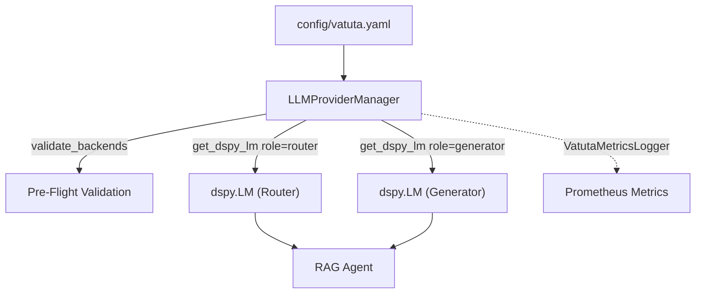

# LLM Model Configuration and Provider Abstraction

Vatuta features a provider-independent language model abstraction built on [LiteLLM](https://litellm.ai/)
and [DSPy](https://github.com/stanfordnlp/dspy). This architecture decouples the assistant's reasoning
and generation capabilities from specific model vendors, allowing seamless switching across LLM providers
via configuration without code modifications.

---

## Architecture Overview

Vatuta's LLM subsystem consists of three core components:

1. **Centralized Provider Manager (`LLMProviderManager`)**:
   Responsible for backend instantiation, validation, caching, and mapping calls to `dspy.LM`.
2. **Role-Based Pipeline Routing**:
   Decouples query routing (`router_backend`) from response synthesis (`generator_backend`), enabling
   optimized cost, latency, and reasoning power for each stage.
3. **Telemetry & Observability Callback (`VatutaMetricsLogger`)**:
   Standardized Prometheus metrics for invocation latency, prompt/completion token consumption, and call
   status across all providers.



---

## Configuration Schema

Configured under the `rag` section in `config/vatuta.yaml`:

```yaml
rag:
  # Map of named backend configurations
  llm_backends:
    gemini_fast:
      model: "google/gemini-2.5-flash"
      temperature: 0.1
      max_tokens: 1024
    gemini_pro:
      model: "google/gemini-2.5-pro"
      temperature: 0.7
      max_tokens: 4096

  # Role assignments (must match keys defined in llm_backends)
  router_backend: "gemini_fast"
  generator_backend: "gemini_pro"
```

### Backend Configuration Parameters

| Parameter | Type | Required | Default | Description |
| :--- | :--- | :--- | :--- | :--- |
| `model` | `str` | Yes | - | Provider/model string in `provider/model_name` format |
| `temperature` | `float` | No | `0.7` | Sampling temperature between `0.0` and `2.0` |
| `max_tokens` | `int` | No | `2048` | Maximum output tokens (must be > 0) |
| `api_base` | `str` | No | `None` | Custom API base URL (useful for local or self-hosted models) |
| `top_p` | `float` | No | `None` | Nucleus sampling parameter between `0.0` and `1.0` |
| `extra_kwargs` | `dict` | No | `{}` | Additional provider-specific parameters passed directly to LiteLLM |

### Model Naming Convention

Model identifiers MUST strictly follow the standard LiteLLM format: `<provider>/<model_name>`.

Examples:

- **Google Gemini**: `google/gemini-2.5-flash`, `google/gemini-2.5-pro`
- **OpenAI**: `openai/gpt-4o-mini`, `openai/gpt-4o`
- **Anthropic**: `anthropic/claude-3-5-sonnet-20241022`, `anthropic/claude-3-5-haiku-20241022`
- **Ollama / Local**: `ollama/llama3.2`, `ollama/mistral`

---

## Role-Based Assignment

Vatuta's RAG pipeline divides LLM operations into two primary roles:

### 1. Router Backend (`router_backend`)

- **Responsibility**: Interprets user intent, applies metadata filters (dates, sources), and determines retrieval.
- **Recommended Model**: Fast, cost-efficient models with low latency (e.g., `google/gemini-2.5-flash`).

### 2. Generator Backend (`generator_backend`)

- **Responsibility**: Synthesizes retrieved chunks and formats the final structured response.
- **Recommended Model**: Reasoning-focused models with high context capacity (e.g., `google/gemini-2.5-pro`).

Both roles can reference the same backend if a single model is preferred.

---

## Startup Pre-Flight Checks

During startup, Vatuta automatically executes broad, non-intrusive pre-flight checks:

1. **Syntax Validation**: Verifies that all configured backend models follow the `provider/model` pattern.
2. **Dynamic Credential Verification**: Inspects environment variables dynamically using LiteLLM's
   built-in validation (`litellm.validate_environment(model)`) without sending remote network pings.

If credentials are missing or model configurations are invalid:

- Vatuta halts immediately without executing queries.
- A user-friendly Rich error panel displays actionable instructions.
- The process terminates cleanly with exit code `1`.

### Required Environment Variables by Provider

- **Google Gemini**: `GEMINI_API_KEY`
- **OpenAI**: `OPENAI_API_KEY`
- **Anthropic**: `ANTHROPIC_API_KEY`

---

## Telemetry and Metrics

Vatuta automatically instruments all LLM invocations using Prometheus:

| Metric Name | Type | Labels | Description |
| :--- | :--- | :--- | :--- |
| `vatuta_llm_call_latency_seconds` | Histogram | `provider`, `role`, `model`, `status` | Call duration in seconds |
| `vatuta_llm_tokens_total` | Counter | `provider`, `role`, `model`, `token_type` | Tokens (`prompt`, `completion`) |
| `vatuta_llm_calls_total` | Counter | `provider`, `role`, `model`, `status` | Total call count (`success`, `failure`) |

Metrics are recorded asynchronously with minimal overhead (< 5ms per call).
